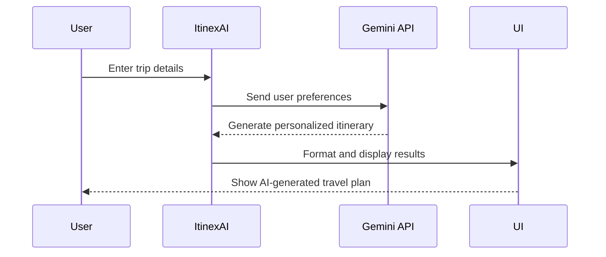

# 🌍 ItinexAI - AI-Powered Smart Travel Planner ✈️  

## 🎒 About the Project  
Tired of endless travel research? **ItinexAI** is your personal AI-powered travel assistant that **builds customized itineraries** in seconds!  
It understands your **preferences, budget, and interests** to craft the perfect trip for you.  

Say goodbye to messy planning & let AI handle it! 🚀  

---

## 🔥 Features  
✨ **AI-Generated Itineraries** – Personalized trip plans in seconds 🤖  
✨ **Real-time Flight Search** – Find flights effortlessly! ✈️  
✨ **Smooth UI/UX** – Beautifully designed with animations 🎭  
✨ **Budget-based Suggestions** – Affordable or luxury? It’s up to you 💰  
✨ **Mobile & Desktop Optimized** – Plan your trip anywhere, anytime 📱💻  
✨ **Instant Markdown Formatting** – View neatly formatted plans 📜  

---

## 🛠️ Tech Stack  

### **Frontend:**  
🔹 **React.js** – Dynamic UI ⚛️  
🔹 **Tailwind CSS** – Sleek styling 🎨  
🔹 **Framer Motion** – Smooth animations ✨  
🔹 **React Markdown** – Clean, readable itineraries 📜  

### **APIs Used:**  
🔹 **Gemini API** – AI-generated itineraries 🤖  
🔹 **SerpAPI** – Fetches live flight data ✈️  

---

## 🏗️ How It Works  

### 📌 **User Journey Flow**  
```mermaid  
graph LR;  
    A[User Enters Travel Details] --> B[AI Generates Itinerary]  
    B --> C[Flight Search (Optional)]  
    C --> D[Fetch Real-Time Flight Prices]  
    B --> E[Format Itinerary in Markdown]  
    E --> F[Display in UI]  
    F --> G[User Reviews & Saves Itinerary]  
    G --> H[Download & Share Options]  
```  

### 🛤 **Itinerary Generation Breakdown**  


---

## ⚡ Installation & Setup  

### 🚀 Quick Start  
1️⃣ **Clone the repository**  
```bash  
git clone   
cd itinexai  
```  
2️⃣ **Install dependencies**  
```bash  
npm install  
```  
3️⃣ **Run the development server**  
```bash  
npm run dev  
```  
🎉 Your AI Travel Planner is live at `http://localhost:3000`!  

---

## 📜 License  
📄 Licensed under **MIT License** – Free to use & modify!  

## 💡 Let’s Connect!  
Want to improve or contribute? Have feedback? Let’s chat!  
🔹 [LinkedIn](https://www.linkedin.com/in/maheshh-s/)  

🛠️ Built with ❤️, AI, and a passion for travel! 🌍✨  

---

