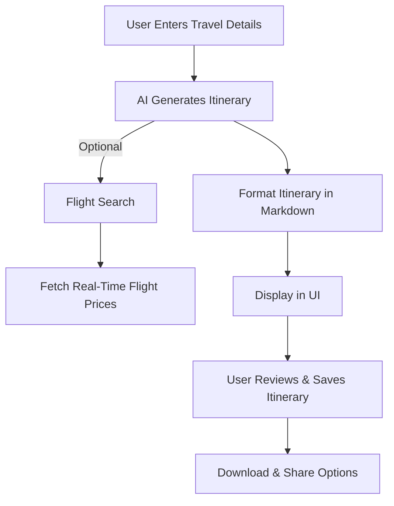

# 🌍 ItinexAI - Your AI-Powered Smart Travel Planner ✈️  

## 🎒 About the Project  
Tired of spending hours planning trips? **ItinexAI** is your **AI-powered travel assistant** that generates **personalized itineraries** in seconds! Just enter your details, and let AI craft the perfect travel experience. 🚀  

Say goodbye to travel stress and explore the world effortlessly! 🌍✨  

---  

## 🔥 Features  
✅ **AI-Generated Itineraries** – Get personalized trip plans instantly 🤖  
✅ **Real-time Flight Search** – Find the best flights with a click! ✈️  
✅ **Smooth UI/UX** – Beautifully designed with animations 🎭  
✅ **Budget-based Recommendations** – Customize plans based on affordability 💰  
✅ **Mobile & Desktop Optimized** – Access your itinerary anywhere 📱💻  
✅ **Instant Markdown Formatting** – Neatly formatted travel plans 📜  

---  

## 🛠️ Tech Stack  

### **Frontend:**  
- ⚛️ **React.js** – Dynamic UI  
- 🎨 **Tailwind CSS** – Modern styling  
- ✨ **Framer Motion** – Smooth animations  
- 📜 **React Markdown** – Clean, readable itineraries  

### **APIs Used:**  
- 🤖 **Gemini API** – AI-generated itineraries  
- ✈️ **SerpAPI** – Fetches real-time flight data  

---  

## 🏗️ How It Works  

### 📌 **User Journey Flow**  


### 🛤 **Itinerary Generation Breakdown**  


---  

## ⚡ Installation & Setup  

### 🚀 Quick Start  
1️⃣ **Clone the repository**  
```bash  
git clone https://github.com/Maheshh-S/ItinexAI.git 
cd itinexai  
```  
2️⃣ **Install dependencies**  
```bash  
npm install  
```  
3️⃣ **Run the development server**  
```bash  
npm run dev  
```  
🎉 Your AI Travel Planner is live at `http://localhost:3000`!  

---  

## 📜 License  
📄 Licensed under **MIT License** – Free to use & modify!  

---  

## 💡 Let’s Connect!  
Want to improve or contribute? Have feedback? Let’s chat!  
🔹 [LinkedIn](https://www.linkedin.com/in/maheshh-s/)  

🛠️ Built with ❤️, AI, and a passion for travel! 🌍✨  

---

